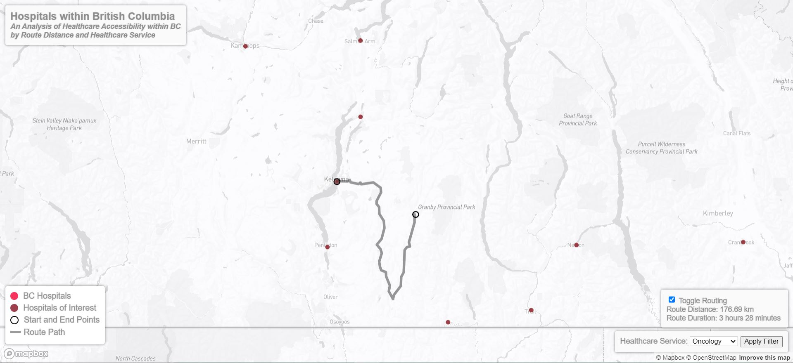
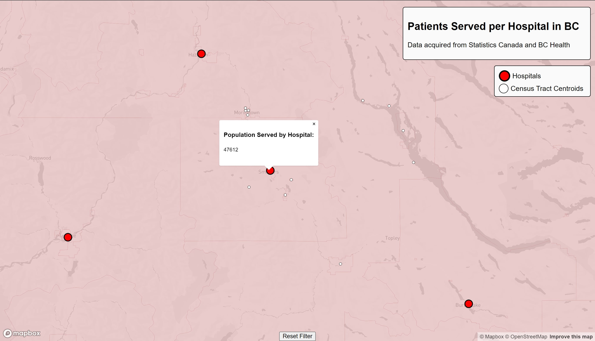
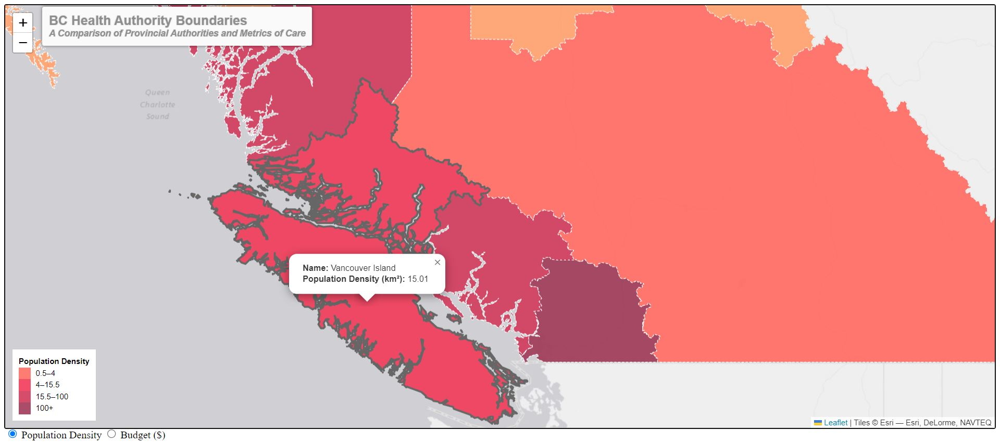


# Assessing the Equity and Accessibility of Healthcare Service in British Columbia
**By Adam McNiece, Andrew Yan, Bosco Wong, and Michael Rohrwasser**

Welcome to the public Github repository for Group 3's Final Project in GEOS 472: Research in Cartography. Here, you will find all the files associated with our project, serving as a centralized storage hub for our work.

## Group Web Essay
You can access our comprehensive web essay by following this [link](https://blogs.ubc.ca/geos472finalgroup3/2024/04/17/healthcare-in-b-c/). In this essay, we delve into the intricacies of our visualizations within this project, discussing the methodologies behind their creation, the rationale for our design choices, and the compelling narrative we aim to convey through them. Explore the insights we've gathered, the data we've analyzed, and the stories we've uncovered as we navigate through the complex landscape of healthcare accessibility.

## Individual Healthcare Routing Visualization
Here is the [link](https://ubc-geos472-spring2024.github.io/group3_final_project/routing_map/routing_hospital.html) to our map, which visualizes the ability for individuals to travel to nearby hospitals for healthcare services.

## Community Reliance Visualization
Here is the [link](https://ubc-geos472-spring2024.github.io/group3_final_project/community_map/Hospital_Population_Analysis.html) to our map, which visualizes the amount of people served by each hospital across BC, based on their proximity to a particular hospital.

## Provincial Health Authorities Visualization
Here is the [link](https://ubc-geos472-spring2024.github.io/group3_final_project/health_authorities_map/combined_boundaries.html) to our map, which visualizes the operational differences between health authorities across BC.

